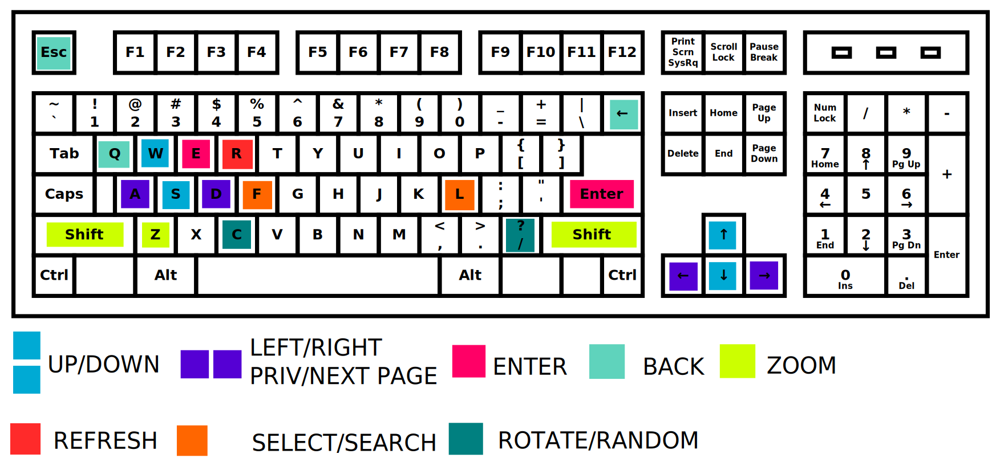

# XHentai

A local doujinshi reader.

# Usage

## Start Server

1. Clone this project.

2. Install dependencies.

```bash
bundle install
```

<!--

*Of course, you need to install Ruby and a [bundler gem](https://github.com/bundler/bundler). 

**Try to fix the errors appearing. You may need to install a _libsqlite3-dev_ or something like that.

-->


3. Start web server.

```bash
rackup -p 8080
```

4. Read doujinshi at [http://localhost:8000/](http://127.0.0.1:8080/)


## Set authorization

```bash
rake seed
```

## Keyboard Shortcut



## Encrypted Datastream ?

Please use HTTPS.

[Configuring HTTPS servers(Nginx)](http://nginx.org/en/docs/http/configuring_https_servers.html)

## Remote Control

To use remote control, two devices should be prepared.

Open [http://localhost:8000/#/remote](http://127.0.0.1:8000/#/remote) in the browsers and type a pair code in both devices, and they will be a control-pair.

*Websocket is required. If you need to configure nginx, try the configure file in conf.d/

Click the button at the bottom of the page in one of the devices, and you can use all the keyboard shortcuts through the other device.

To stop, go back to the remote page and click "UNLINK". Refreshing or closing the page can also close the connection.

*Yes, you can control multiply devices or control one device through multiply devices, but that would be wired.

## Supported Websites

* e-hentai
* nhentai


